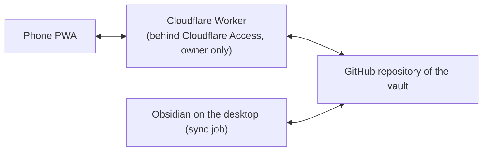

# Vault Companion

A private phone app for acting on an Obsidian vault. Markdown and Git stay the only source of truth.

Obsidian on a phone is not always the best place to quickly act on a task, note, or decision.
Vault Companion gives the owner a focused phone interface without creating a second database
or taking ownership away from the vault.

## What you can do

### Tasks

- See tasks in Today, Overdue, and All views.
- Complete a task and Undo it when needed.
- Capture a task such as "Water the plants" or a note from the phone; drafts survive closing or losing the app.
- Edit a task's text, dates, and priority.
- Open notes linked from a task.

### Active Work

- See the items that are currently in focus.
- Add an active-work item from the phone.
- Review items whose review date has passed, including Keep for another seven days.
- Finish any item at any time with Done, Park, or Drop; Drop asks for a reason.
- Undo an active-work action.

### History

- Browse completed tasks day by day, with the newest day first.
- Reopen a completed task and Undo that reopening when needed.

### Notes

- Browse, read, and edit notes in the vault's inbox area from the phone.

### Scouts

- Check the health of the owner's automated research scouts, including last attempt and last success.
- Read human times such as "12 min ago" and "Yesterday 06:51".
- Read scout findings on a phone; tables become labelled cards.

### Event triage

- Swipe through suggested events and choose Go, Maybe, or Skip with a reason.
- Append decisions to the vault; a desktop job adds Go events to the calendar.

### Training

- Log a run (distance, time) or a gym session (split, duration, optional body weight) in a few taps.
- See all sessions newest first, with run pace computed; older rows keep whatever they have.
- Each session is one row in the vault's training-log table; Undo removes exactly that row.

### Offline work

- Keep working offline; actions queue on the device and are sent when back online; a retried send never applies an action twice.
- See honest states: "On this device", "Saved to GitHub", and "Needs attention".
- See when the desktop last synced in the vault status line.
- Install the app as a PWA and receive an update banner.

## How it works



- The phone reaches the worker only through Cloudflare Access for the owner.
- Every write is a minimal span splice with exact golden-diff tests.
- Unsupported Markdown shapes are refused, never guessed.
- Every command has an operation ID and a base revision.
- Writes compare and swap on the branch head, carry commit trailers, and are deduplicated, so each action takes effect exactly once.
- Logs contain no task or note text.
- Private vault content never enters this repository; fixtures are synthetic.

## Tech stack

- A pnpm monorepo written in TypeScript.
- `apps/web`: React + Vite PWA.
- `apps/worker`: Hono on Cloudflare Workers, using the Workers Free plan.
- `packages/domain` and `packages/vault-markdown`: pure packages with no framework imports.
- `packages/contracts`: shared contracts using zod.
- Vitest for unit tests.
- Playwright e2e on WebKit (iPhone) and Chromium.

## Getting started

Install dependencies and run the local checks:

```sh
pnpm install
pnpm check
pnpm test
pnpm build
pnpm --filter ./apps/web e2e
```

`pnpm check` runs lint, typecheck, and tests.

Deployment is documented in [docs/deploy.md](docs/deploy.md) and needs the owner's Cloudflare and GitHub setup.

## Documentation map

| Document | What it covers |
| --- | --- |
| [docs/product-contract.md](docs/product-contract.md) | Scope |
| [docs/vault-contract.md](docs/vault-contract.md) | Exact Markdown rules |
| [docs/commands.md](docs/commands.md) | Retry and receipts |
| [docs/architecture.md](docs/architecture.md) | Architecture |
| [docs/sync.md](docs/sync.md) | Sync |
| [docs/security.md](docs/security.md) | Security |
| [docs/threat-model.md](docs/threat-model.md) | Threat model |
| [docs/testing.md](docs/testing.md) | Testing |
| [docs/decisions/](docs/decisions/) | 24 ADRs |
| [docs/plan.md](docs/plan.md) | Current work |

## Project status

Vault Companion is a personal project for one owner and is in daily use on an iPhone.

It is built with AI coding agents under a Lead agent; see [docs/orchestration.md](docs/orchestration.md).

It is not a general product, and it does not offer support.
